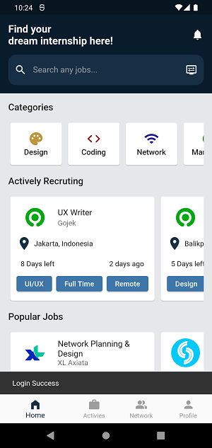
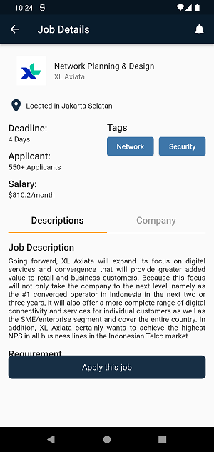
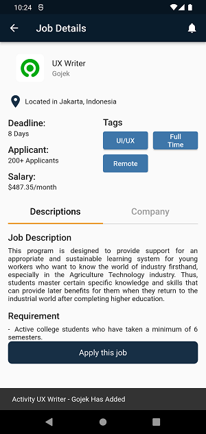
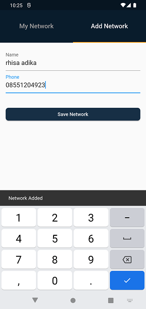
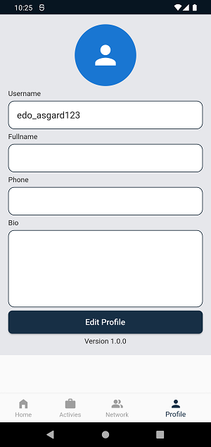

# Flutter-Internship.id

An internship seeker-themed front end mobile application

## Link to download apk

https://bit.ly/internship-id

## Feature

The application is a mobile front end design for the development of internship and job search applications.

## Package used in

- flutter_custom_tab_bar: ^1.1.9
- provider: ^6.0.2
- uuid: ^3.0.6
- intl: ^0.17.0
- file_picker: ^4.5.1

## Some app screenshots

### SplashScreen

### LoginScreen

### HomeScreen

### PerCategoryScreen

### DetailScreen

### DetailApplyScreen

### ActivitiesScreen

### ActivitiesDeleteScreen

### AddNetworkScreen

### MyNetworkScreen

### ProfileScreen

### ProfileScreen

### ProfilePermissionMediaScreen

### EditProfileScreen

### ProfileAfterEditScreen
